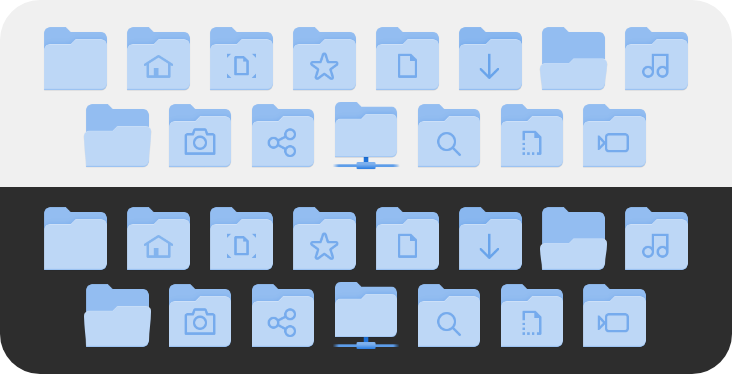

# Adwaita-Blue icon theme

Adwaita icon theme but folder icons are blue

## How to install

### For single user

Download this [zip](https://github.com/realmazharhussain/adwaita-blue-icon-theme/archive/refs/heads/main.zip) (or [tar.gz](https://github.com/realmazharhussain/adwaita-blue-icon-theme/archive/refs/heads/main.tar.gz)) file and extract folder `Adwaita-Blue` from it to `$HOME/.local/share/icons/` 

### System-wide

Download this [zip](https://github.com/realmazharhussain/adwaita-blue-icon-theme/archive/refs/heads/main.zip) (or [tar.gz](https://github.com/realmazharhussain/adwaita-blue-icon-theme/archive/refs/heads/main.tar.gz)) file and extract folder `Adwaita-Blue` from it to `/usr/share/icons/`
