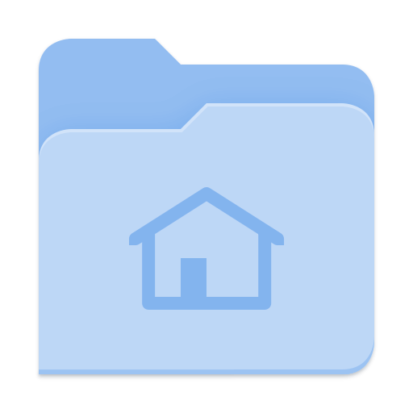
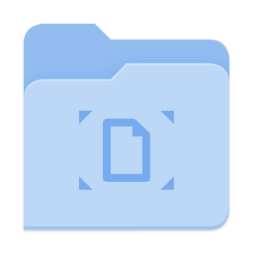
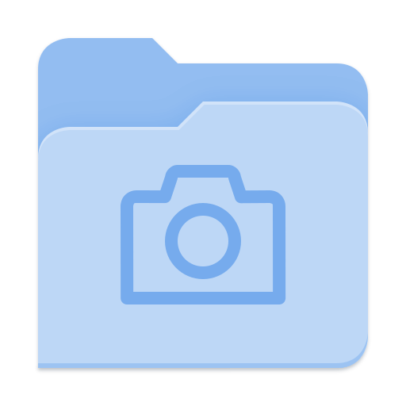
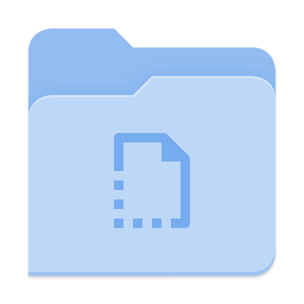

# Adwaita-Blue icon theme

Adwaita icon theme but folder icons are blue

                

                

## How to install

### For single user

Download the zip file and extract it to `$HOME/.local/share/icons/` 

### System-wide

Download the zip file and extract it to `/usr/share/icons/`